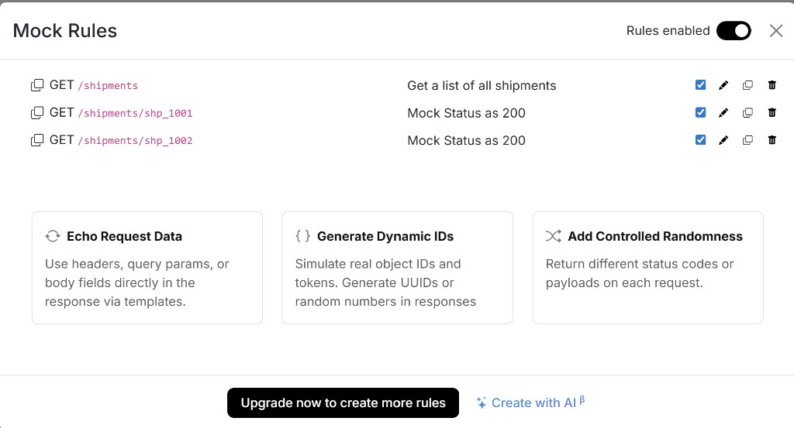
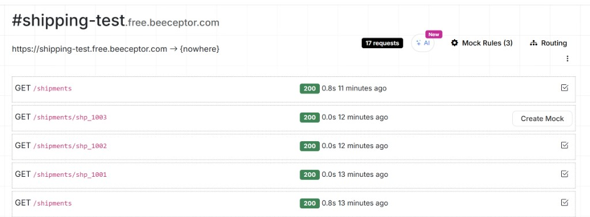

# Tracker Android – Shipment List

This project is a take-home technical assignment.

---

## Tech stack

- Kotlin
- Jetpack Compose
- Hilt for Dependency Injection
- Retrofit
- Room
- Coroutines / Flow
- MVI architecture

---

## Requirements

- Android Studio latest stable version recommended
- Android SDK / emulator or physical Android device
- Internet access for the hosted mock API endpoint (detail timeline loads from the network when possible)

---

## How to run locally

1. Clone the repository.
2. Open the project in Android Studio.
3. Sync Gradle.
4. Build and run the `app` module on an emulator or Android device.
5. Pull to refresh on the list to sync shipments, then **tap a shipment** to open the **detail** screen (status history and route summary).

---

## Mock API setup

This project uses a hosted mock REST/JSON endpoint for shipment data.

For this project [Beeceptor](https://beeceptor.com/) was used to set up the mock API.

The screenshots below show example Beeceptor configuration for `https://shipping-test.free.beeceptor.com`: **Mock Rules** for `GET /shipments` and per-id detail routes, and the **request log** showing successful `GET /shipments` and `GET /shipments/{id}` calls from the app (for example `shp_1001`, `shp_1002`).





Please note that a daily limit of **only 50 requests** is allowed on the free tier.

If the endpoint is unavailable or you want to test with your own data:

1. Update the Retrofit base URL in `app/src/main/java/com/tracker/trackertechnical/di/NetworkModule.kt`.
2. Ensure the endpoint exposes:
   - **`GET /shipments`** — list response matching `ShipmentsResponseDto`.
   - **`GET /shipments/{id}`** — single shipment matching `ShipmentDetailDto` (same `id` values as in the list).

On Beeceptor, add **one mock rule per shipment id** (for example `/shipments/shp_1001`, `/shipments/shp_1002`, …) or use path wildcards if your plan supports them, so every id you can open in the app returns a valid detail JSON body.

### Example list response shape

```json
{
  "shipments": [
    {
      "id": "shp_1001",
      "carrier": { "code": "ups", "name": "UPS" },
      "trackingNumber": "1Z999AA10123456784",
      "lastStatus": { "code": "IN_TRANSIT", "label": "In transit" },
      "lastUpdatedAt": "2026-02-26T14:20:00Z",
      "origin": { "city": "Seattle", "country": "US" },
      "destination": { "city": "Austin", "country": "US" },
      "estimatedDeliveryAt": "2026-03-02T23:00:00Z"
    }
  ]
}
```

### Example detail response shape (`GET /shipments/shp_1001`)

```json
{
  "id": "shp_1001",
  "carrier": { "code": "ups", "name": "UPS" },
  "trackingNumber": "1Z999AA10123456784",
  "origin": { "city": "Seattle", "country": "US" },
  "destination": { "city": "Austin", "country": "US" },
  "estimatedDeliveryAt": "2026-03-02T23:00:00Z",
  "statuses": [
    {
      "time": "2026-02-26T14:20:00Z",
      "code": "IN_TRANSIT",
      "label": "Departed facility",
      "location": "Portland, OR"
    },
    {
      "time": "2026-02-25T08:10:00Z",
      "code": "LABEL_CREATED",
      "label": "Label created",
      "location": "Seattle, WA"
    }
  ]
}
```

### Offline behavior (detail)

If **`GET /shipments/{id}`** fails (for example, offline or missing Beeceptor rule) but that shipment exists in the local Room cache from a previous list sync, the app still opens the detail screen and shows **origin, destination, estimated delivery**, and a **single “last known” status** from the cache, with a banner explaining that the full timeline is not available offline.

If there is **no** cached row for that id, the detail screen shows an error with **Retry**.
